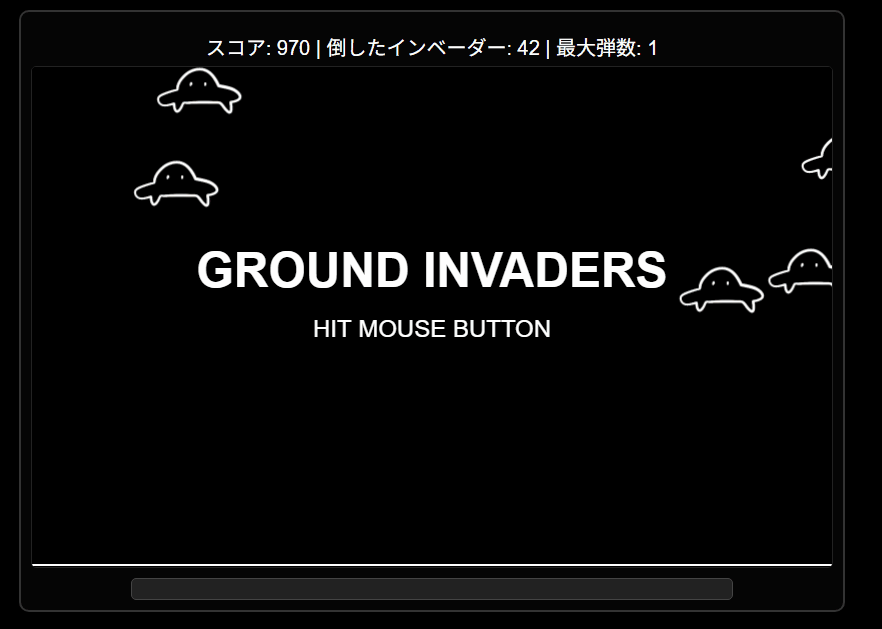

# GROUND INVADERS 🚀

## 公開ページ
[https://keigox68000.github.io/GroundInvaders/](https://keigox68000.github.io/GroundInvaders/)

## これはなに？
画面左端の砲台を操作し、画面右や上空から侵攻してくるインベーダーやUFOを撃ち落とす、完全マウスオペレーションのシューティングゲームです。

## ルール
- **照準操作:**
    - マウスカーソルの方向に砲台の砲身が向きます。
    - 砲身の角度は仰角30度～80度の範囲に制限されます。
- **弾の発射:**
    - マウスの左ボタンを**押している間**: 画面下部のパワーゲージが伸縮します。
    - マウスの左ボタンを**離した時**: 弾を発射します。
    - 弾の飛距離は、ボタンを離した瞬間のパワーゲージの長さで変化します。
- **弾の仕様:**
    - 弾は放物線を描いて飛びます。
    - 発射された弾は、一定時間（0.2秒）経過するまで当たり判定がありません（至近距離の敵には無効）。
    - 画面上に同時に存在できる弾の数は、スコアに応じて増加します（初期1発、スコア1000点ごとに1発追加）。
- **インベーダー:**
    - 画面右端から水平に、または画面上部からランダムに落下して出現し、着地後は左の砲台に向かってきます。
    - 各インベーダーは出現時に基本速度から多少ランダムな速度が設定されます。
    - 撃破するとスコア10点を獲得。
    - 倒すごとに、次に出現するインベーダーの基本速度が徐々に上昇し、出現間隔も短縮＆ランダム化されます。
- **UFO:**
    - インベーダーを5匹倒すごとに1機出現します。
    - 撃破すると高得点（50～300点のランダムなスコア）を獲得できます。
    - UFOには「直進型」「投下型」「回転投下型」などの種類があり、それぞれ動きやインベーダーの投下パターンが異なります。
- **ゲームオーバー:**
    - インベーダーが砲台の直前（砲台の幅の約25%の位置）まで到達すると、砲台が爆発しゲームオーバーとなります。
    - ゲームオーバー表示後、3秒でデモ画面に戻ります。

Good Luck! 👍